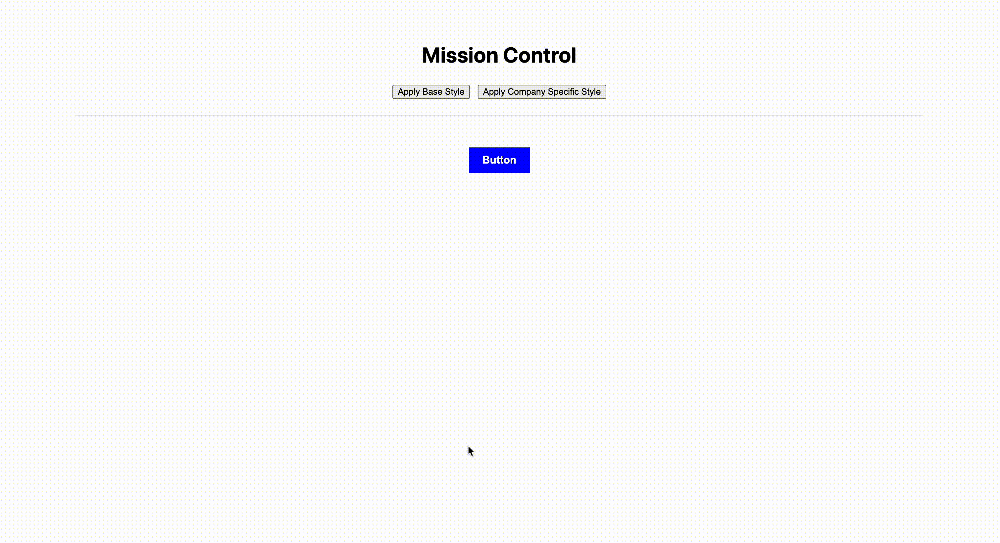

# Simple Design System - ✅ COMPLETED

A React application that implements a design system with theme switching capabilities. This project demonstrates the use of React Context API for dynamic theming.

## 🎯 Assessment Status: **COMPLETED SUCCESSFULLY**

All requirements have been implemented and the application is fully functional.

## 🚀 Features

- **Dynamic Theme Switching**: Toggle between base and company-specific themes
- **React Context API**: Proper implementation of theme context
- **Component-Based Architecture**: Clean separation of concerns
- **Real-time Updates**: Theme changes apply instantly without page reload

## 📁 Project Structure

```
├── configs/
│   ├── base-tokens.js          # Base theme configuration
│   └── external-tokens.js      # Company-specific theme configuration
├── src/
│   ├── components/
│   │   └── button.jsx          # Themed button component
│   ├── App.jsx                 # Main application with theme controls
│   └── main.jsx                # Application entry point
├── utils/
│   └── theme-provider.jsx      # Theme context and provider
└── README.md
```

## 🛠️ Implementation Details

### Theme Provider (`utils/theme-provider.jsx`)
- ✅ **ThemeContext**: Created using React's Context API
- ✅ **ThemeProvider Component**: Accepts tokens and children, provides context
- ✅ **useTheme Hook**: Returns current theme tokens with proper error handling

### Button Component (`src/components/button.jsx`)
- ✅ **Theme Integration**: Uses `useTheme` hook to access theme tokens
- ✅ **Dynamic Styling**: Automatically updates when theme changes

### App Component (`src/App.jsx`)
- ✅ **Theme Switching**: Controls to toggle between base and company themes
- ✅ **State Management**: Uses React state for theme management
- ✅ **Provider Wrapping**: Properly wraps components with ThemeProvider

## 🎨 Theme Configurations

### Base Theme (`configs/base-tokens.js`)
```javascript
{
  button: {
    backgroundColor: 'blue',
    color: '#fff',
    borderRadius: '0',
    // ... other styles
  }
}
```

### Company Theme (`configs/external-tokens.js`)
```javascript
{
  button: {
    backgroundColor: 'yellow',
    color: 'black',
    borderRadius: '40px',
    // ... other styles
  }
}
```

## 🚀 Getting Started

1. **Install Dependencies**:
   ```bash
   npm install
   ```

2. **Run Development Server**:
   ```bash
   npm run dev
   ```

3. **Build for Production**:
   ```bash
   npm run build
   ```

## ✅ Success Criteria Met

1. ✅ Button component renders with correct styling based on selected theme
2. ✅ Theme switching works without page reload
3. ✅ Base tokens are properly merged with external tokens
4. ✅ `useTheme` hook properly handles context and error cases
5. ✅ Clean, maintainable code structure
6. ✅ Proper error handling and edge cases

## 🎯 Technical Achievements

- **React Context API**: Proper implementation of theme context
- **Dynamic Theming**: Real-time theme switching
- **Error Handling**: Robust error handling for context usage
- **Code Quality**: Clean, readable, and maintainable code
- **Performance**: Efficient theme updates without unnecessary re-renders

## 📸 Demo

The application demonstrates a button component that dynamically changes its appearance based on the selected theme:

- **Base Style**: Blue background with white text
- **Company Style**: Yellow background with black text and rounded corners



---

**Assessment completed successfully!** 🎉
